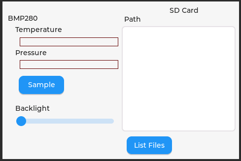

# SquareLine example

This example is intended to demonstrate the features supported by esp-lcd-3-5-diy. The display shown here is SquareLine generated (and the Squareline project files are included to potentially be used as a starting point). 

First the display is initialized, and the SquareLine screen is displayed

Then I2C is initalized. For this example, it is assumed that a BMP280 (or BME280) is plugged into the I2C connector. If not, a "BMP280 not found" message is shown.

The display has a "Sample" button. When it is pressed, a meassurement is taken and the temprature and pressure measurements are reported in separate labels.

The display has a "List Files" button. when it is pressed, the directory of the current SD Card is read and the files are displayed in a text area. An error is displayed if unable to read the SD Card.

The disp;lay has a Backlight slider that controls the backlight birghtness.

The example is component based. Just copy the examples/SquareLine directory and its content to a local directory, and execute "idf.py build" or load it into your favorite IDE (mine is VS Code) and build it. It will fetch all of the necessary components transparently.

In the implementation, BtnSampleClicked(), BtnLsClicked(), and SldBacklightChanged() are event functions configured (but not exported) by SquareLine. These functions, implemented in main.c execute the event initiated activities.
